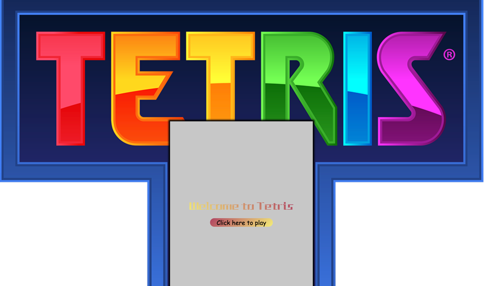

This project is a part of module ECM1417 Web Development.

The goal is to create a <strong>tetris game</strong> on linux azure VM.

>Technologies stack:
- Apache
- Php
- Js/Ajax
- CSS

>Project allowed users to:
- Register an account
- Play tetris
- Compete with other players with the help of a leaderboard

You can access the vm by clicking this link:  
http://ml-lab-4d78f073-aa49-4f0e-bce2-31e5254052c7.ukwest.cloudapp.azure.com:56614/index.php

